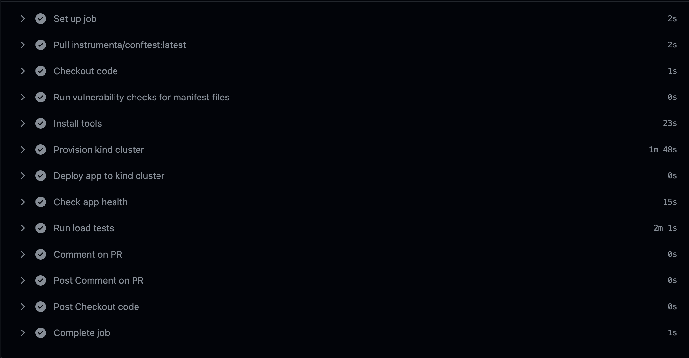

# CI LOAD TEST
This project runs load tests in the CI on http-echo server services that is deployed to a kubernetes kind cluster

# CI/CD graphical representation

# How it works
When you create a Pull Request into the master branch from any branch, a CI workflow is triggered that performs all the actions as seen in the CI graphical representation above step by step.

The following highlights some CI features:
- **Security**: Before deploying the app to the cluster, vulnerability checks will be run on the k8s manifests files. [OPA Conftest](https://github.com/open-policy-agent/conftest) was used to test configuration files. The rego assertion file is in **opa/** directory.
- **Automation**: A kinD k8s cluster is provisioned using terraform configuration files in **terraform/** directory. This was done this way to adhere to Infrastructure as Code (IaC) best practices that makes our infrastructure reproducible and manageable.
- **Monitoring**: A monitoring solution was deployed using [kube-prometheus-stack](https://github.com/prometheus-community/helm-charts/blob/main/charts/kube-prometheus-stack/README.md) via terraform.

# Tools, Languages or Technologies used
- [conftest-action](https://github.com/instrumenta/conftest-action) for vulnerability tests
- [k6](https://github.com/grafana/k6/blob/master/README.md) for load testing
- [kube-prometheus-stack](https://github.com/prometheus-community/helm-charts/blob/main/charts/kube-prometheus-stack/README.md) for monitoring
- [kinD](https://kind.sigs.k8s.io/) for a multi-node k8s cluster
- [actions-comment-pull-request](https://github.com/thollander/actions-comment-pull-request/blob/main/README.md) for pr comment
- [ingress nginx controller](https://github.com/kubernetes/ingress-nginx/blob/main/README.md) for load balancing
- [github actions](https://docs.github.com/en/actions) for CI/CD
- [terraform](https://developer.hashicorp.com/terraform) to provision infrastructure in the CI
- bash script to orchestrate some steps in the CI

# Errors encountered and fixes
These highlights some errors I faced along with the fixes:
- **Load Test Results**:
  - **Issue**: when analyzing the load test results, I noticed the *http_req_failed passes and fails values* contradicted the *http_req_failed value in the summary report*. This is currently a bug in k6 as highlighted [here](https://github.com/grafana/k6/issues/2386)
  - **Fix**: Swapped the values for http_req_failed passes and fails.
- **Kubernetes and Helm Providers config_path argument**:
  - **Issue**: For some reason, the *kubernetes and helm providers config_path argument* don't see the kubeconfig file when it's specified as a path in a variable in the CI runner.
  - **Fix**: 
    - Got the kubeconfig contents of the provisioned kinD cluster from the *kind_cluster* terraform resource attribute,
    - Wrote these kubeconfig contents to a file using the *local_file* terraform resource,
    - Referenced the *local_file* terraform resource in the both the *kubernetes and helm providers config_path argument value*.
  - **Note**: This occurs just in the Github Actions CI runner which runs ubuntu. Provisioning outside the CI runner on a local machine don't have this issue i.e. it can read from the kubeconfig file if specified in the variable.

# Areas for my further research and project improvement
- Optimizing the CI workflow via caching
- A truely composable CI for for unit testing e.g using typescript with github actions

# Time
This took about a day and a half of work - This time includes Research, Implementing, Debugging and with breaks in between.